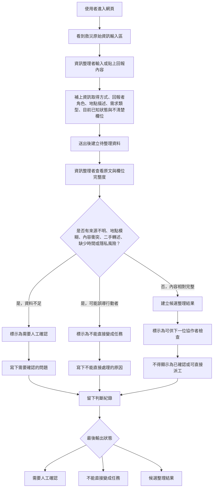

# 資訊流程設計

> 這份文件可以由 Codex 先產生草稿，但你必須用 VS Code 預覽 Mermaid，並由人檢查流程是否合理。

## 我的 v1 目標

請用 2–3 句寫下你現在的 v1 方向。

- 我優先服務的使用者：資訊整理者
- 這個使用者最想完成的事：將雜亂的訊息整理並細緻分類給行動者
- 我最想避免的錯誤：分類不完全，AI誤判極端值

## 自然語言流程描述

使用者進入網頁後，先看到一個救災原始資訊輸入區。資訊整理者可以輸入或貼上回報內容，並補上資訊取得方式、回報者角色、地點描述、需求類型、目前已知狀態，以及哪些欄位仍不清楚。

送出後，系統不會直接把這筆資料變成救災任務，而是先建立一筆「待整理資料」。資訊整理者先查看原文與欄位完整度，判斷這筆資訊是否有來源不明、地點模糊、內容衝突、二手轉述、缺少時間或可能涉及隱私等問題。

如果資料不足，系統將它標示為「需要人工確認」，並要求整理者寫下需要確認的問題。如果資料看起來可能誤導行動者，例如地點不明、需求不明、對象不明，則標示為「不能直接變成任務」。

如果資料內容相對完整，資訊整理者可以建立候選整理結果，但候選結果仍不能顯示為已確認。它只能表示「目前可供下一位協作者檢查」，不能表示可以直接派工或採取救災行動。

每一次分類、修改、暫時不採用或標示需要確認時，都要留下判斷紀錄，說明是誰做了判斷、根據哪些原始資訊、還有哪些不確定點。最後輸出會分成三種狀態：需要人工確認、不能直接變成任務、候選整理結果。
## Mermaid 流程圖

## 人工確認點

請列出流程中哪些地方必須由人判斷。

- 回報內容是否足夠清楚，包含地點、需求、對象與目前狀態。
- 資訊取得方式是否可靠，不能只因為來源看起來正式就當成已確認。
- 需求類型是否判斷正確，避免把模糊描述硬分類成救災任務。
- 是否可能涉及隱私資訊，需要避免直接公開或擴散。
- 這筆資料是否只能建立候選整理結果，而不能直接派工。
- 標示為「不能直接變成任務」的理由是否合理。
- AI 或系統產生的整理結果是否補了原文沒有明確說的內容。

## 操作或判斷紀錄

- 新增一筆原始資訊時，記錄誰建立、何時建立、原文內容與資訊取得方式。
- 修改回報內容或整理欄位時，要記錄修改前後差異與修改原因。
- 將資料標示為「需要人工確認」時，要記錄需要確認的問題。
- 將資料標示為「不能直接變成任務」時，要記錄不能處理的理由。
- 建立候選整理結果時，要記錄它根據哪些原始資訊整理而來。
- 刪除、暫時不採用或重設整理結果時，要記錄操作原因。
- 人類修正 AI 或系統建議時，要記錄採用或不採用的理由。
- 判斷資料涉及隱私風險時，要記錄風險類型，但不要公開真實個資。

## 我檢查後修正了什麼

請寫下你用 `docs/design-checklist.md` 檢查後，至少修正的一件事。

- 原本：
- 修正後：
- 為什麼：

## 我仍不確定的流程點

請列出目前還需要後續驗證或訪談的地方。

-
-
